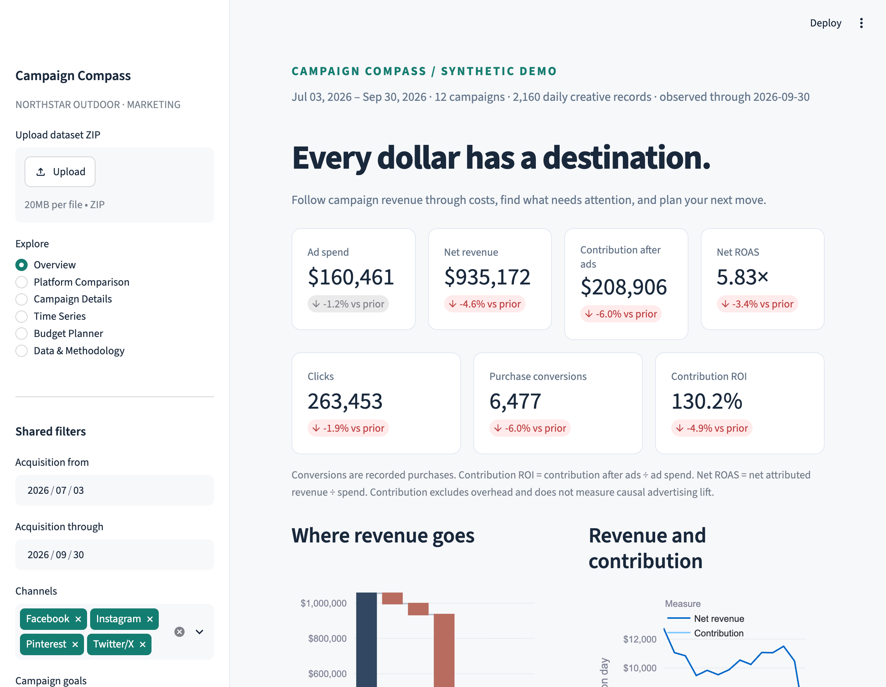
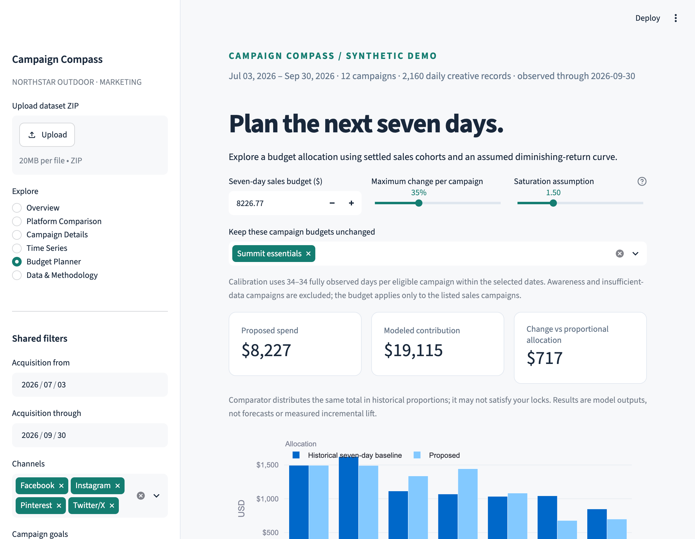

# Campaign Compass

Investigate advertising performance and plan budgets using contribution economics, recorded purchase events, and explicit assumptions.

An original Week 1 option 2 project for a fictional retailer, **Northstar Outdoor**. The bundled data is synthetic. No customer records, source-project code, or source-project dataset are reused.

[](https://github.com/naresh25ganji/campaign-compass/actions/workflows/tests.yml)

**[Open the live app](https://campaign-compass.streamlit.app/)** — hosted on Streamlit Community Cloud.

## A decision worth investigating

An impressive revenue multiple can hide losses after product costs, discounts, and returns. Start with **Last chance packs**, inspect its contribution, compare purchase outcomes at equal ages, then explore a constrained budget scenario. Download a decision brief to share the evidence and assumptions.





## Start locally

Python 3.11 or newer is required. No API key, database, or paid service is needed.

```bash
git clone https://github.com/naresh25ganji/campaign-compass.git
cd campaign-compass
uv sync --frozen
uv run streamlit run app.py --server.address 127.0.0.1
```

Open http://localhost:8501. Alternatively:

```bash
python3 -m venv .venv
source .venv/bin/activate
python -m pip install -r requirements.txt
streamlit run app.py --server.address 127.0.0.1
```

## Views

- **Overview:** spend, clicks, purchase conversions, revenue, contribution ROI, ROAS, cost waterfall, spend/conversion trends, and investigation links.
- **Platform Comparison:** channel economics within shared goal and audience filters.
- **Campaign Details:** literal search, cost breakdown, prior-period drivers, and creative engagement.
- **Time Series:** daily/weekly metrics and equal-age purchase curves with visible denominators.
- **Budget Planner:** seven-day allocation, constraints, locks, assumed saturation, sensitivity, CSV export, and a decision brief with the current scenario.
- **Data & Methodology:** provenance, formulas, validation, and dataset ZIP import/export.

Date, channel, goal, audience, and fully observed-cohort filters are shared. Empty selections mean no results. Reset restores data-derived defaults. Investigation links preserve filter context.

## Share a decision brief

The Overview exports an HTML brief with current filters, observed totals, campaign economics, and investigation evidence. Budget Planner adds its current budget, limits, locks, allocations, comparator, and sensitivity assumptions. Open the downloaded file in a browser to share or print it. Report content is generated from the selected records without an external AI service.

## Data and definitions

The generator creates 12 campaigns, 4,320 daily creative records, and 13,365 recorded orders with seed 20261007. Acquisition dates span April 4–September 30, 2026; events are observed through September 30. The required Facebook, Instagram, Pinterest, and Twitter/X channels are retained.

```bash
uv run python -m campaign_compass.generate --output data
```

Scenarios include high ROAS with poor margins and returns, engagement decline, conversion decline, and delayed purchases. App findings are computed from records; they do not read generator scenario labels.

- Rates use summed numerators and denominators. Undefined ratios display a dash.
- Net revenue = gross revenue − discounts − observed refunds.
- Contribution = net revenue − net product cost − fulfillment/payment/return costs − ad spend. Fixed overhead, taxes, and lifetime value are excluded.
- Dates select acquisition cohorts. Related order/refund events are credited through the as-of date.
- Single-campaign order attribution does not establish advertising incrementality.
- Fully observed demo cohorts are at least 56 days old: up to 21 purchase-lag days plus 35 return-lag days. Imported datasets must meet that assumption or be interpreted separately.
- Planning uses sales campaigns with 7 fully observed days, 20 purchases, and positive contribution before ads. Awareness and insufficient-data campaigns are excluded.
- The response curve is an assumption anchored on history, not a causal model or forecast. Sensitivity scenarios are assumptions, not confidence intervals.

See [the dataset contract](docs/DATA_CONTRACT.md), [demo storyboard](docs/DEMO.md), and [deployment instructions](docs/DEPLOYMENT.md).

## Verification and structure

```bash
uv run pytest -q
```

Tests reconcile the order ledger, check spend-preserving joins, weighted ratios, invalid uploads, cohort eligibility, allocation constraints, and app interactions.

```text
app.py                         Streamlit interface
campaign_compass/generate.py    Original seeded dataset generator
campaign_compass/data.py        Validation and ZIP import/export
campaign_compass/analytics.py   Facts, metrics, cohorts, investigations
campaign_compass/planner.py     Response model and constrained allocation
campaign_compass/brief.py       Self-contained HTML decision brief
campaign_compass/charts.py      Chart styling and units
data/                          Source tables and manifest
docs/                          Data contract, demo, development evidence
tests/                         Analytics, planner, and interaction tests
```

Randomized experiments, customer-level CAC deduplication, real platform connectors, automated screenshot capture, and deployment are not implemented. Run the app locally using the instructions above; website hosting is a separate step.
